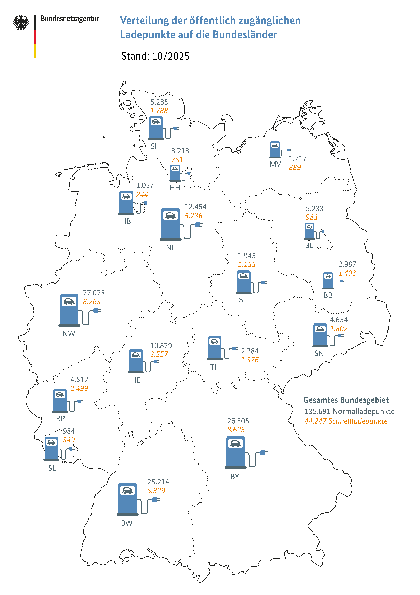

# Electric-Loading-Stations-in-Berlin
Electric mobility is essential in order to reduce emission of green house gases. In recent years sales and usage of electric vehicles has accelerated significantly. However lack of electric charging stations in many areas remains impediment for further success. Based on geovisualization of different datasets referring to Berlin we want to analyze demand for additional electric charging stations. 
 
In general, areas with large population and low number of charging stations have demand for more of them. Furthermore large number of one-family-houses reduces demand, because owners of electric car install charger on their private property. However reliable and free data about ratios of housing types is not or only partly available. Therefore only population numbers and numbers of charging stations will be considered.



---

## Project Structure
```
/
├── core/                       # Core logic and utility packages
│   ├── __init__.py
│   ├── methods.py              # Data preprocessing and visualization logic
│   └── HelperTools.py          # Generic helper functions and decorators
├── datasets/                   # Raw CSV data and Geometry files
│   ├── berlin_bezirke/         # District-level shapefiles
│   ├── berlin_postleitzahlen/  # Postal code-level shapefiles
│   ├── Ladesaeulenregister.csv # Charging station registry
│   ├── plz_einwohner.csv       # Resident data by PLZ
│   ├── geodata_berlin_plz.csv  # Geometry data for PLZ
│   └── ...
├── doc/                        # Contains documentation files like images
├── config.py                   # Centralized configuration (paths, variables)
├── main.py                     # Application entry point
├── requirements.txt            # Python dependencies
└── README.md                   # Project documentation
```
---

## Data Requirements
We have three CSVs located in datasets folder.

1. Charging Station Registry(Ladesaeulenregister.csv)
Source: Official Federal Network Agency (Bundesnetzagentur)
- Encoding: latin1
- Delimiter: Semicolon
- Decimal Separate: Comma

| Column Name  | Data Type    | Description & Constraints                                       |
|--------------|--------------|-----------------------------------------------------------------|
| Postleitzahl | Integer      | Between 10115 & 14200                                           |
| Bundesland   | String       | Needs to be Berlin                                              |
| Breitengrad  | String/Float | Latitude in German format                                       |
| Längengrad   | String/Float | Longitude. The code expects German formatting (e.g., "13,4050") |
| Nennleistung Ladeeinrichtung [kW]   | Numeric      | Power Capacity of the station                                   |

2. Residents Data (plz_einwohner.csv)
- Encoding: utf-8 (default)
- Delimiter: Comma

| Column Name | Data Type    | Description & Constraints               |
|-------------|--------------|-----------------------------------------|
| plz         | Integer      | Postal Code 10000 < x < 14200           |
| einwohner   | Integer      | Total population count for specific PLZ |
| lat         | String/Float | Centroid Latitude of PLZ German Format  |
| lon         | String/Float | Centroid Longitude of PLZ German Format |

3. Geometry Data (geodata_berlin_plz.csv)
- Delimiter: Semicolon

| Column Name | Data Type      | Description & Constraints                                                 |
|-------------|----------------|---------------------------------------------------------------------------|
| PLZ         | Integer/String | Matches PLZ in statistical dataset                                        |
| geometry    | String (WKT)   | Well-known Text (WKT) e.g. Polygon. If missing or corrupt will be dropped |


---


## Gap Analysis: EV Charging Infrastructure in Berlin
This project employs a bivariate spatial analysis to compare **Residential Population Density (Demand)** against **Public Charging Station Distribution (Supply)** across Berlin ZIP codes.

**The Core Finding:**
Berlin exhibits a critical **"Structural Mismatch"** in its infrastructure rollout.
1.  **The Center (Mitte)** is well-served.
2.  **The Eastern Corridor (Biesdorf)** is statistically saturated, likely due to commercial transit hubs rather than residential need.
3.  **The High-Density Residential Belt (The Ring)** where the need is highest due to a lack of private parking is significantly underserved.

---

### 2. Methodology: Demand vs. Supply

#### A. Demand Layer (Population Density)
* **Metric:** Residents per ZIP code.
* **High Density (Red/Orange):** Concentrated in the "Wilhelminian Ring" (Neukölln, Kreuzberg, Friedrichshain, Prenzlauer Berg, Wedding, Charlottenburg) and high-rise estates in the East (Marzahn/Hellersdorf).
* **Implication:** Areas with high vertical density (Multi-Dwelling Units or MDUs) lack private driveways. **Residents here are 100% dependent on public street charging.**

#### B. Supply Layer (Charging Stations)
* **Metric:** Count of public charging points per ZIP code.
* **Distribution:** Heavily skewed towards the city center (Mitte) and specific commercial arteries (B1/B5 in Biesdorf).
* **Deficit:** The majority of residential districts show "Yellow" (Low Supply), creating a mismatch in areas where EV adoption is stifled by infrastructure anxiety.

---

### 3. Priority 1: The "Crisis Belt" (Inner City Ring)
*Definition: High Population Density (>20k) + Low Infrastructure (<10 stations).*

These districts represent the highest ROI (Return on Investment) for new stations because the gap between potential users and available plugs is widest. Residents here generally cannot install Wallboxes.

* **Neukölln (North):** (PLZ: 12043, 12045, 12047)
    * *Status:* Extreme population density; almost zero public infrastructure coverage.
    * *Action:* **Critical Priority.**
* **Wedding & Moabit:** (PLZ: 13347, 13353, 10551)
    * *Status:* Densely populated working-class districts. Currently acting as "charging deserts."
    * *Action:* **Critical Priority.**
* **Charlottenburg-Wilmersdorf:** (PLZ: 10585, 10623)
    * *Status:* Wealthier demographic with higher likelihood of EV ownership, yet the map shows significant infrastructure gaps compared to neighboring Mitte.
    * *Action:* **High Priority.**
* **Friedrichshain:** (PLZ: 10245, 10247)
    * *Status:* High density of young professionals (early adopters), currently underserved.

---

### 4. Priority 2: The Eastern Dichotomy (The Biesdorf Anomaly)
*Definition: A spatial mismatch where supply is located in commercial zones, ignoring residential zones.*

This area highlights a flaw in simple data interpretation:
* **The Anomaly (Biesdorf - 12683):**
    * *Observation:* Shows **Red (High Supply)**.
    * *Reality:* This is a **Transit/Commercial Hub** along the B1/B5 highway (Retail parks, Hardware stores, Dealerships). It serves commuters and shoppers, **not residents**.
* **The Opportunity (Marzahn - 12681, 12685):**
    * *Observation:* Just north of Biesdorf, the map is **Yellow (Low Supply)**.
    * *Reality:* This area contains high-density *Plattenbau* (high-rise) estates. Residents here have no garages and cannot use the "Shopper Chargers" in Biesdorf for overnight parking.
    * *Action:* Shift focus from the Biesdorf commercial strip to the **Marzahn residential interior**.

---

### 5. Priority 3: Outer District Centers
*Definition: Localized density spikes in the suburbs.*

* **Spandau (Center - 13581):** A "city within a city" that is currently isolated from the charging network.
* **Steglitz:** High residential density with minimal curbside options.

---

### 6. Low Priority / No Action Required

#### A. Saturated Zones
* **Mitte (10115, 10117):**
    * Supply is high and proportional to commercial activity. No urgent expansion needed relative to other districts.

#### B. Self-Sufficient Zones (Suburbs)
* **Wannsee, Gatow, Frohnau, Mahlsdorf:**
    * *Status:* Low population density (Green) and Low Supply (Yellow).
    * *Reasoning:* Predominantly Single-Family Homes (SFH). Residents here install private chargers in their driveways. Public infrastructure here has a very low utilization rate and is not a priority.

---

### 7. Strategic Recommendations

To maximize utilization rates and support the mobility transition, the rollout strategy must pivot:

1.  **Stop optimizing for "Coverage Maps":** Placing chargers in commercial strips (like Biesdorf) makes the map look good but doesn't help residents.
2.  **Target "Overnight" Zones:** Focus entirely on **Neukölln**, **Wedding**, and **Marzahn North**. These are the areas where EV adoption is physically impossible without public street infrastructure.
3.  **Data Filtering:** For future analysis, filter out "High Power Chargers" (HPC) at gas stations to get a true picture of "Residential Neighborhood Charging" availability.

## Demo
These images are the results from the code and the analysis based on them.


You can check the application live at: https://electric-loading-stations-in-berlin.streamlit.app/